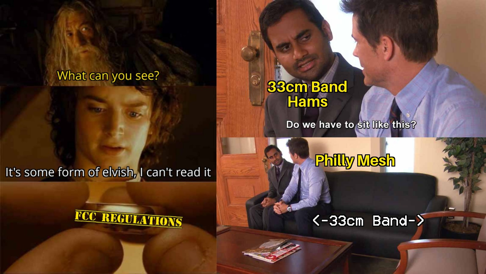

**(tl;dr - Based on Philly testing, in Philly for MeshCore (primary mesh) we will move to freq=919.500, bw=500, sf=10, cr=5. In Philly for Meshtastic (secondary mesh) we will stay on LongTurbo-0.)**


Hey Philly Mesh nerds (affectionate), 

We've been on MC500 for the past month, and the mesh itself has been working amazingly well with the community on board. It was a hurdle for many of us to get nodes flashed to new firmware, install new apps, learn new lingo, and just overall change everything. Change is hard, change is tiring, but y'all have also made change fun. So thank you for that.

We have gotten a LOT of outside-of-the-mesh feedback on our change as well. There is a raging debate as to whether the previous 62.5 kHz (MeshCore) or 250 kHz (Meshtastic) settings are actually illegal (we're not lawyers but we think they're illegal), whether the FCC will enforce the regs (still doesn't change the legality), whether we should care (we do), and whether the changes are good for the nationwide mesh (we don't know, our work and decisions were focused on Philly alone). 

Our [9/4/2026 post and proposed change](<https://phillymesh.net/2026/09/02/fcc-regulations/>) was for the local PhillyMesh community, and we didn't expect people to think we were trying to propose a new nationwide standard. We still believe one default frequency for everyone in the US on MeshCore at the 500 kHz bandwidth isn't feasible (more about that below), but we love folks from all over the country popping in to discuss what we've found on Discord.

There are two very important points that have been brought up to us that are significant and need to be addressed.  In our initial rush to become FCC compliant, we missed the mark, and because of that, we __will__ have to move frequencies one more time. Additionally, we made a region-wide recommendation on a timeline that left no room to hear objections from the community, or from each other. We should have asked first, and we'd likely have caught some of this if we had.


## Issue 1: We're Not Alone *eerie alien static*
Okay, so we don't share the airwaves with extraterrestrials (that we know of) but we do share them with Amateur Radio Operators, affectionately known as hams. The 902-928 ISM Band that we've been using for Meshtastic and MeshCore is also known as the 33cm Amateur Radio Band. We knew this when we picked the new frequency and we listened and listened and we heard no one using the frequency we picked for MC500. BUT, we have since learned, the frequency we picked is where hams do "weak signal work" aka the worst possible place for us to add interference. It's also in conflict with a repeater uplink frequency that -- while infrequently used in the Philly area -- is rude of us to knowingly interfere with now that we know it's there. The hams in OpsDiv also had a misunderstanding of prioritization of the band: we thought Amateur Radio and unlicensed mesh activities were both secondary on the ISM band, when in fact Amateur Radio is secondary and unlicensed activity is last priority.

__We messed this up in our original frequency pick, but we've put a lot more work and outreach into the new choice__, and we've reached out to other ham clubs that operate in 33cm (and everywhere else) for better coordination with our new frequency selection. We're also getting their input to make sure there aren't any other \*Rumsfeld voice\* "unknown unknowns" since none of the hams in PRM OpsDiv regularly work the 33cm band.



## Issue 2: Our Radios Are Dirtier Than a PHL Terminal E Restroom
This one caught us off guard, pun intended. There is [a great writeup here](https://beala.substack.com/p/the-fcc-want-me-to-use-more-bandwidth) that describes the issue (and our folly) nicely and fairly. 

We had assumed that the channelization of Meshtastic meant that operating within those channels on devices that are FCC approved was safe and legal. Kinda like when you get a walkie talkie (aka FRS radio) and it's got channels 1 through 14, you can operate on channel 1 without issue. 

We improperly put that trust in the firmware and we have since learned that the hardware has been found in testing to NOT be clean enough to run like this. Some radios aren't too dirty, some are very dirty. This means Meshtastic Frequency Slot 1 and 2 (or just Slot 1 on LongTurbo) is transmitting outside of the 902-928 ISM Band on some radios, which is against FCC regs. So yeah, we assumed using MeshCore at these same frequencies was okay but __we messed this up too and we apologize.__ 

This is a problem we knew ham radios have, but they're blasting 20, 100, 1500W of output power on an antenna not perfectly tuned for the frequency. We didn't know, say, a teeeeeny tiny lil' Seeed Xiao radio outputting 0.125W on a perfect SWR antenna also has this problem. And it's exacerbated by the wider bandwidth we're using. So yeah, we moved to 902.250 to be not-illegal (compared to previous bandwidth settings) and yet even after that some radios are still on the edge of illegality.

## What We're Doing About It
As described in Issue #1, we've already reached out to more ham clubs. We had already received input from GCARC, but now we've reached out to the clubs that operate the 33cm band repeaters in Philly too with not a lot of response back. If you're operating or using a 33cm repeater - and reading this and you've got input, send us an email at hello@phillymesh.net or join our [Discord](<https://discord.gg/MWWbAkRR9v>) to chat. Regardless, to proactively avoid interfering with 33cm usage, the best spot in the band plan is middle-ish of the 902-928 ISM Band (which also fixes Issue #2 because we're far away from the band edge). 

In the Philly area, we have spent a LOT of time this past month listening to SDRs, comparing where interference is bad in the Philly area vs where it isn't, and then putting those observations into action by trying a few of the promising spots. Many of the potential "national presets" being discussed, including using the existing 910.525 at 500 kHz bandwidth, have been proven by our testing to NOT work well in the Philly area.

After our testing, we have a few changes that we will be making for where/how we operate our mesh going forward. 

1. **Frequency:** Based on the issues with being on the band edge and in the weak-signal-work zone of the 902-928 ISM Band, we looked for a spot in the middle of the 902-928 ISM Band and **we have landed on 919.500 MHz** for a center frequency. We have confirmed that there are no listed conflicts with hams at this specific spot via RepeaterBook and the ham clubs we're in contact with. Again if there is something we missed, PLEASE reach out to us.

2. **Spreading Factor:** Also abbreviated to SF, this is a parameter that describes how a LoRa transmission encodes its signal over time. High number SFs mean that the chirp signal is spread over a longer duration, so the data rate is lower but can travel farther. Lower number SFs mean the signal is compressed into a shorter duration, so the data rate is higher but it typically results in shorter ranges.
a. Our assumption when moving to 500 kHz bandwidth (and corroborated by some of the MeshCore and Meshtastic blogs) was that we would have to use SF11 for links to survive the wider bandwidth (which impacts range) as well as the higher bandwidth. Basically "talk slower to be better understood" but in LoRa.
b. That assumption was proven incorrect based on our testing. Faster SF10 (instead of slower SF11) has shown to work best with our settings. Our theory is that the longer SF11 transmit time means that there is more likelihood that the packet will get interfered with by 902-928 ISM Band noise. Finishing the transmission quicker using SF10 means less opportunity for random 902-928 ISM Band noise to interfere. This is a balance because moving even lower in SF does indeed degrade link quality. This balance is something we're going to continue to monitor and OpsDiv may prescribe additional testing in the future. For now we believe we've struck the right balance for the mesh we have now with SF10.
c. A nice upside of this SF pick is that it is noticeably faster and "snappier" for the end-user to manage repeaters over LoRa.

3. **Hashtag Channels:** To help keep the future mesh's conversations and messages organized, we are asking all MeshCore users to make a behavior change from the previous Meshtastic "post everything on LongFast". MeshCore lets you add "hashtag" channels, aka you don't need a PSK like in Meshtastic. 
a. Public - This is the default channel that is pre-setup (you don't need to add this). Also the one most likely to be used by neighboring meshes once we interconnect.
b. #prm - Please add this one and use it as the main channel to talk within the Philly metro area. The mindset here is if neighboring meshes use the same MeshCore preset/settings, the Public channel may get busy with wide-area traffic and may inhibit some of the great local conversations we had when testing a Philly-only mesh. 
c. #test - For the "Can you hear me now?" that inevitably comes with setting up a new node, traveling, etc. Quarantining it in a separate channel prevents those tests from distracting the #prm conversations, as well as letting you spam "CENTRAL JERSEY ACK" as many times as you want. There are also bots setup in several places in the mesh to auto-respond to messages in this channel. In other words, please do not type "testing", "test 123", "can anyone hear me?", etc into either Public or #prm. This also allows folks to setup per-channel notification settings and mute this channel.
d. Other commonly used (but totally optional) hashtag channels are listed in this pinned post on the Discord here: https://discord.com/channels/1350649001313173526/1546522444603326544/1547250444223643820

4. **MeshCore vs Meshtastic:** We've fielded a lot of questions about our plans for Meshtastic going forward. "Are you abandoning Meshtastic?" "What if I want to keep using Meshtastic?" We'll try to answer them below:
a. We are shifting to a `MeshCore = Primary Network … Meshtastic = Secondary Network` strategy due to MeshCore's "messaging first" basis and Meshtastic's [LongTurbo challenges we experienced during testing](<https://phillymesh.net/2026/08/12/freq-testing-report/>). __We are not abandoning Meshtastic.__
b. We will continue to support Meshtastic on dual-radio infrastructure nodes as we can (especially going forward).
c. We will only use Meshtastic on its LongTurbo default FreqSlot of 0. We have no plans of doing a similar frequency search for something non-default. Nor will we support presets that are not FCC-compliant on our infrastructure.
d. Many of us will continue running both MeshCore and Meshtastic in our home setups. We encourage others to as well, each has its pros/cons and uses!
e. Our previous stance against the "us versus them" tribalism some communities exhibited will continue to be the policy of PhillyMesh. We think both protocols have different use cases and understand how different people could gravitate towards one or the other. Just because we chose MeshCore as our primary network does not mean we will "peer pressure" folks to move from Meshtastic if they don't want to. If you want to use Meshtastic, please do! And you'll continue to get our same help and support to set up and run your node.

**We will be moving the mesh to these new settings first thing on Friday 10/2/26. We are all incredibly appreciative for the mesh community's help with all of the SDR inputs/listening, testing, and feedback this past month. We are all looking forward to moving to a home that works for the entire community (including non-mesh stakeholders like ham 33cm band users) and shifting our focus to infrastructure buildout to continue making Philly Mesh more reliable and connected for all in the area.**


## How We Determined Our New Frequency/Settings

A quick summary of Philly's methodology is below:
1. RTL-SDR data collection across region
2. Data analysis for lowest noise floors
3. Automated Lora packet delivery testing
4. Validation of results with hands-on SDR monitoring to select final proposed frequency
5. Mesh-wide test of new settings with end-users

### 1) RTL-SDR data collection
In the MeshCore Discord, some of our members and others from outside started trying to find ways to collect data, locally and even on a larger scale. We knew it wouldn't be perfect, and we knew others would have opinions on better methods, now and in the future. But we had to start SOMEWHERE with a unified data set. One of the ways we did that was with a scripted version of RTL_POWER, something that can be run with a cheap RPi and RTL-SDR dongle.
```rtl_power -f 902M:928M:5k -i 5 -e 30m -g 32

902M:928M    Scan the entire 902–928 MHz band
5k           Target roughly 5 kHz frequency-bin resolution
-i 5         Complete/report a sweep every 5 seconds
-e 30m       Keep collecting for 30 minutes
-g 32        Fixed RTL-SDR gain of 32 dB```

The downside to lots of collections across multiple regions, was that the larger meshcore community went from not enough data, to waaaaaaaaaaaaay too much data, and everyone had different opinions on how to wrangle it.


### 2) Data analysis for lowest noise floors
For PhillyMesh, after going crazy looking at the data specific to our region every which way, we decided to combine a lot of our previous methods. We took a top-down approach, using the simplest tools already at our members' disposal and trying not to over complicate or re-invent things that were already accessible. With so much information, it's easy to get overwhelmed.

We took all the RTL_POWER data and looked for the regions with the lowest noise floors in general. And then manually scoped them with our SDRs and tossed any false positives from compression/artifacts/skewed data. (Another flaw we later found in the data collection method, thanks again to the [great post by Alex Beal describing this in further detail](https://beala.substack.com/p/searching-for-a-new-frequency-and).)

Our next step was to have people spread out across the region manually look at their SDRs in the three areas with the lowest noise floors identified above. The goal was to try and find region-wide low-interference spots we have here in Philly.


### 3) Automated Lora packet delivery testing
After we distilled it down to 3-4 top areas, we ran a [custom packet test script](https://github.com/dustyheatsink/prm-lorasweep) based on the awesome concept from [cisien on the MeshCore discord](https://github.com/Cisien/meshcore-snr-sweep), tweaked to match our Pi-based infrastructure, using two nodes that had line of sight: one at our worst location (in terms of interference) and our best.

At its core, the script  automated the testing of small, medium, and large packets between the two sites. The two devices linked via TCP so they knew when to start, when to expect packets, etc. The script fired off 20 packets of each size from one site to another and then recorded how many LoRa packets arrived successfully, which ones produced CRC/header errors, and how many were missed. Obviously, you want the best delivery rate with zero errors and misses, but everything is relative.

The custom script loaded a CSV with frequencies and SFs to test. At first it was just general areas on the 902-928 ISM Band, then slowly it was dialed in to slide the centers around slightly. Every test began with testing our current 902.25 MHz frequency, so you were always comparing apples to apples in terms of general interference/conditions and propagation. The idea behind it was sometimes RF sucks, weather sucks, interference sucks, but if we always started with what we were on NOW and were messaging successfully with, you always knew how to stack the others against it.

### 4) Validation of results with hands-on SDR monitoring to select final proposed frequency
Our top pick that came out of all of that was 919.5 MHz. It had the best symmetry on RX/TX between the two sites that were 7 miles apart (one of our longer links), and that was traversing a region we know has heavy interference due to known RFID sources. The idea being if it can work passing through that RF hellscape, it should probably be pretty damn good in areas without it. 
 
One thing to note: we also had members check for Philly-specific conflicts with repeater inputs/output and coordinated systems, and talked to our local ARCs (Amateur Radio Clubs) about our proposed new settings. We want to make sure we're good neighbors on the airwaves and not knowingly (or unknowingly) causing interference.

### 5) Mesh-wide test of new settings with end-users
But at the end of the day, theoretical picture-perfect packets and delivery rates mean little, compared to the metric of "can an end user message, and be heard"? So it came down to actually testing with real nodes and people.

After some quick checking to ensure the data lined up with reality between 3 devices over the long link, we shared the available options with the community for larger scale testing, one frequency at a time. For each test, a meaningful number of nodes changed their repeater settings for hours at a time to test if they could message each other as they could before on 902.250. Use of the [PhillyMesh CoreScope](https://corescope500.phlm.sh/#/packets) aided greatly in users being able to see the reach of their messages during these tests and what messages they may be missing.

Our awesome community members jumped in and really did an amazing job putting them all through their paces. In the end, the top pick across the data held true. 919.5 MHz SF10 was the best candidate for our real-world mesh testing and communications.


